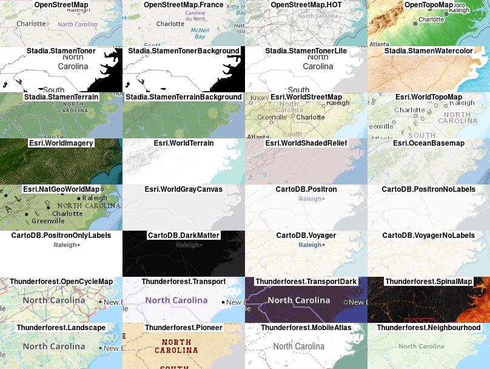

<!-- README.md is generated from README.Rmd. Please edit that file -->

```{r, include = FALSE}
knitr::opts_chunk$set(
  collapse = TRUE,
  comment = "#>",
  fig.path = "man/figures/README-",
  out.width = "100%"
)
knitr::knit_hooks$set(margin = function(before, options, envir){
  if (before){
    par(mar=c(0,0,0,0))
  } 
})
```

# maptiles

<!-- badges: start -->
[](https://github.com/riatelab/maptiles/actions)
[](https://codecov.io/gh/riatelab/maptiles/)
<!-- badges: end -->

The goal of `maptiles` is to download, compose and display map tiles with R. 


## Installation

<!-- You can install the released version of maptiles from [CRAN](https://CRAN.R-project.org) with: -->

<!-- ``` r -->
<!-- install.packages("maptiles") -->
<!-- ``` -->

You can install the development version of `maptiles` from GitHub with:

``` r
# install.packages("devtools")
devtools::install_github("riatelab/maptiles")
```
## Example

This is a basic example which shows you how to dowload OpenStreetMap tiles over North Carolina:

```{r example,fig.ext="png", margin = TRUE, fig.width=852/96, fig.height = 269/96, dpi = 96, out.width=852, out.height=269}
library(sf)
library(maptiles)
nc <- st_read(system.file("shape/nc.shp", package="sf"), quiet = TRUE)

# dowload tiles and compose raster (SpatRaster)
nc_osm <- mp_get_tiles(nc, crop = TRUE)
# display map
mp_tiles(nc_osm)
plot(st_geometry(nc), col = NA, add = TRUE)
mtext(text = mp_get_tiles_attribution("OpenStreetMap"), 
      side = 1, line = -1, adj = 1, cex = .9, font = 3)
```


`maptiles` already gives access to a lot of tiles servers, but it is possible to 
add others. In the following example we also cache the original tiles for future use:


```{r example2,fig.ext="png", margin = TRUE, fig.width=852/96, fig.height = 269/96, dpi = 96, out.width=852, out.height=269}
# define the query
fullserver <- paste("https://server.arcgisonline.com/ArcGIS/rest/services",
                    "Specialty/DeLorme_World_Base_Map/MapServer",
                    "tile/{z}/{y}/{x}.jpg",
                    sep = "/")
# define the tile server parameter
esri <-  list(
  src = 'esri',
  q = fullserver,
  sub = NA,
  cit = 'Tiles: Esri; Copyright: 2012 DeLorme'
)

# dowload tiles and compose raster (SpatRaster)
nc_esri <- mp_get_tiles(x = nc, provider = esri, crop = TRUE, 
                        cachedir = "tilesfolder", verbose = TRUE)
# display map
mp_tiles(nc_esri)
mtext(text = esri$cit, side = 1, line = -1, adj = 1, cex = .9, font = 3)
```


The following figure shows mini maps for most of the providers available:




## Attribution of map tiles

All maps available through `maptiles` are offered freely by various providers. 
The only counterpart from the user is to properly display an attribution text on the maps. 
`mp_get_tiles_attribution()` display a short credit text to add on each map produced with the downloaded tiles. 


## Background

Most of `maptiles`code comes from `getTiles()` and `tilesLayer()` functions in [`cartography`](https://github.com/riatelab/cartography). It uses `terra` instead of `raster` for managing raster data.


## Alternatives

* [`ceramic`](https://github.com/hypertidy/ceramic)  
* [`rosm`](https://github.com/paleolimbot/rosm)
* [`ggspatial`](https://github.com/paleolimbot/ggspatial) (`ggplot2` focused, based on `rosm`)
* [`mapboxapi`](https://github.com/walkerke/mapboxapi)
* [`OpenStreetMap`](https://github.com/ifellows/ROSM) (require Java)
* [`ggmap`](https://github.com/dkahle/ggmap) (`ggplot2` focused)
* ...

## Note

Not to be confused with [`tilemaps`](https://github.com/kaerosen/tilemaps), that "implements an algorithm for generating maps, known as tile maps, in which each region is represented by a single tile of the same shape and size."
