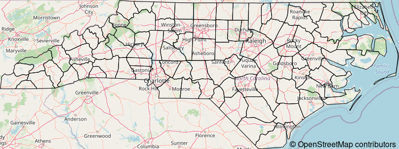

<!-- README.md is generated from README.Rmd. Please edit that file -->

# maptiles

<!-- badges: start -->

[](https://cran.r-project.org/package=maptiles)
[](https://github.com/riatelab/maptiles/actions)
[](https://codecov.io/gh/riatelab/maptiles/)
<!-- badges: end -->

To create maps from tiles, `maptiles` downloads, composes and displays
tiles from a large number of providers (e.g. OpenStreetMap, Stamen,
Esri, CARTO, or Thunderforest).

## Installation

You can install the released version of maptiles from
[CRAN](https://CRAN.R-project.org/package=maptiles) with:

``` r
install.packages("maptiles")
```

You can install the development version of `maptiles` from GitHub with:

``` r
# install.packages("remotes")
remotes::install_github("riatelab/maptiles")
```

**Note:** `maptiles` uses [`terra`](https://github.com/rspatial/terra)
which requires a recent version of GDAL (&gt;= 3.0.4).

## Demo

This is a basic example which shows you how to dowload and display
OpenStreetMap tiles over North Carolina:

``` r
library(sf)
#> Linking to GEOS 3.7.1, GDAL 3.1.2, PROJ 7.1.0
library(maptiles)
# import North Carolina counties
nc_raw <- st_read(system.file("shape/nc.shp", package="sf"), 
              quiet = TRUE)
# Project to EPSG:3857
nc <- st_transform(nc_raw, "EPSG:3857")
# dowload tiles and compose raster (SpatRaster)
nc_osm <- get_tiles(nc, crop = TRUE)
# display map
plot_tiles(nc_osm)
# add Norh Carolina counties
plot(st_geometry(nc), col = NA, add = TRUE)
# add credit
mtext(text = get_credit("OpenStreetMap"), 
      side = 1, line = -1, adj = 1, cex = .9, 
      font = 3)
```

<!-- {width=852px} -->


`maptiles` gives access to a lot of tiles servers, but it is possible to
add others. The following example demonstrates the setting of a map
tiles server and how to cache the original tiles for future use:

``` r
# define the tile server parameters
osmnolbl <- list(src = 'osmnolabel',
                 q = 'https://{s}.tiles.wmflabs.org/osm-no-labels/{z}/{x}/{y}.png',
                 sub = c('a','b', 'c'), 
                 cit = '© OpenStreetMap contributors.')
# dowload tiles and compose raster (SpatRaster)
nc_osmnolbl <- get_tiles(x = nc, provider = osmnolbl, crop = TRUE, 
                         cachedir = tempdir(), verbose = TRUE)
#> https://a.tiles.wmflabs.org/osm-no-labels/7/34/50.png => /tmp/RtmpTstEb7/osmnolabel/osmnolabel_7_34_50.png
#> https://c.tiles.wmflabs.org/osm-no-labels/7/35/50.png => /tmp/RtmpTstEb7/osmnolabel/osmnolabel_7_35_50.png
#> https://a.tiles.wmflabs.org/osm-no-labels/7/36/50.png => /tmp/RtmpTstEb7/osmnolabel/osmnolabel_7_36_50.png
#> https://a.tiles.wmflabs.org/osm-no-labels/7/37/50.png => /tmp/RtmpTstEb7/osmnolabel/osmnolabel_7_37_50.png
#> https://a.tiles.wmflabs.org/osm-no-labels/7/34/51.png => /tmp/RtmpTstEb7/osmnolabel/osmnolabel_7_34_51.png
#> https://a.tiles.wmflabs.org/osm-no-labels/7/35/51.png => /tmp/RtmpTstEb7/osmnolabel/osmnolabel_7_35_51.png
#> https://a.tiles.wmflabs.org/osm-no-labels/7/36/51.png => /tmp/RtmpTstEb7/osmnolabel/osmnolabel_7_36_51.png
#> https://a.tiles.wmflabs.org/osm-no-labels/7/37/51.png => /tmp/RtmpTstEb7/osmnolabel/osmnolabel_7_37_51.png
#> Zoom:7
#> Data and map tiles sources:
#> © OpenStreetMap contributors.
# display map
plot_tiles(nc_osmnolbl)
# display credits
mtext(text = osmnolbl$cit, side = 1, line = -1, 
      adj = 1, cex = .9, font = 3)
```

<!-- {width=852px}    -->


The following figure shows mini maps for most of the tiles providers
available:

<!-- {width=840px} -->


## Projection

Original tiles use a projection known as “Web Mercator”, “WGS84 / Pseudo
Mercator”, “Google Mercator”, “EPSG:3857” or “EPSG:900913”. In most
cases `get_tiles()` uses the projection of its `x` argument to reproject
the tiles. If you wish to avoid any deformation induced by the
reprojection process, use “EPSG:3857” for `x` projection.

## Attribution of map tiles

All maps available through `maptiles` are offered freely by various
providers. The only counterpart from the user is to properly display an
attribution text on the maps. `get_credit()` displays a short credit
text to add on each map using the downloaded tiles.

## Background

Most of `maptiles`code comes from `getTiles()` and `tilesLayer()`
functions in [`cartography`](https://github.com/riatelab/cartography).
It appears useful to me to have a package focused on the download and
display of map tiles only. On the technical side, it uses `terra`
instead of `raster` for managing raster data.

## Alternatives

There are many alternative packages that pursue the same objective as
`maptiles`. Some focus on a specific map tiles provider (e.g. mapbox,
google, OpenStreetMap) or on a specific graphics device (`ggplot2`). The
goal of `maptiles` is to be flexible enough to allow the use of
different providers and to have a minimal number of robust and modern
dependencies. However, depending on the use case, one of following
packages may better suit your needs:

-   [`ceramic`](https://github.com/hypertidy/ceramic)  
-   [`ggmap`](https://github.com/dkahle/ggmap) (`ggplot2` focused)
-   [`ggspatial`](https://github.com/paleolimbot/ggspatial) (`ggplot2`
    focused, based on `rosm`)
-   [`mapboxapi`](https://github.com/walkerke/mapboxapi) (mapbox)
-   [`mapsapi`](https://github.com/michaeldorman/mapsapi/) (google,
    based on `RgoogleMaps`)
-   [`OpenStreetMap`](https://github.com/ifellows/ROSM) (requires Java)
-   [`RgoogleMaps`](https://github.com/markusloecher/rgooglemaps)
    (google)
-   [`rosm`](https://github.com/paleolimbot/rosm)
-   …

## Note

Not to be confused with
[`tilemaps`](https://github.com/kaerosen/tilemaps), that “implements an
algorithm for generating maps, known as tile maps, in which each region
is represented by a single tile of the same shape and size.”
